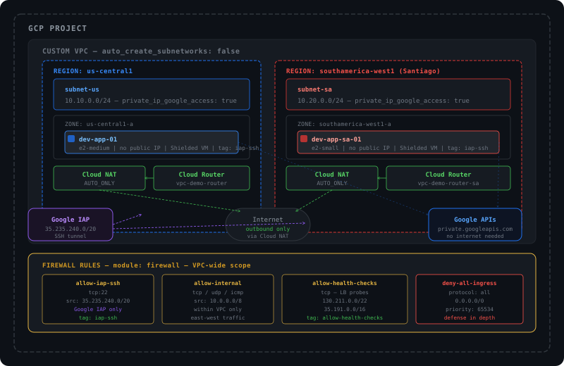

# GCP Infrastructure with Terraform

Infrastructure as Code for Google Cloud Platform using Terraform with modular architecture and best practices.

## Architecture



### Module structure

```
├── modules/
│   ├── vpc/        # VPC, subnets, Cloud Router, Cloud NAT
│   ├── compute/    # Compute Engine instances
│   └── firewall/   # Firewall rules
└── environments/
    └── dev/        # Development environment — consumes all modules
```

## Resources provisioned

- Custom VPC with regional subnets
- Cloud Router + Cloud NAT (outbound internet without public IPs)
- Compute Engine instances (private, no public IP)
- Firewall rules with least-privilege approach (IAP SSH access only)

## Prerequisites

- Terraform >= 1.5
- GCP project with billing enabled
- `gcloud auth application-default login`

## Usage

```bash
cd environments/dev
cp terraform.tfvars.example terraform.tfvars
# edit terraform.tfvars with your values
terraform init
terraform plan
terraform apply
```

## Security notes

- Instances have no public IP — access via IAP tunnel only
- SSH open only from Google IAP range (35.235.240.0/20)
- Cloud NAT handles outbound traffic without exposing instances
- All resources tagged for cost allocation

## Author

Matías Cataldo — [GitHub](https://github.com/braIntelligent)
